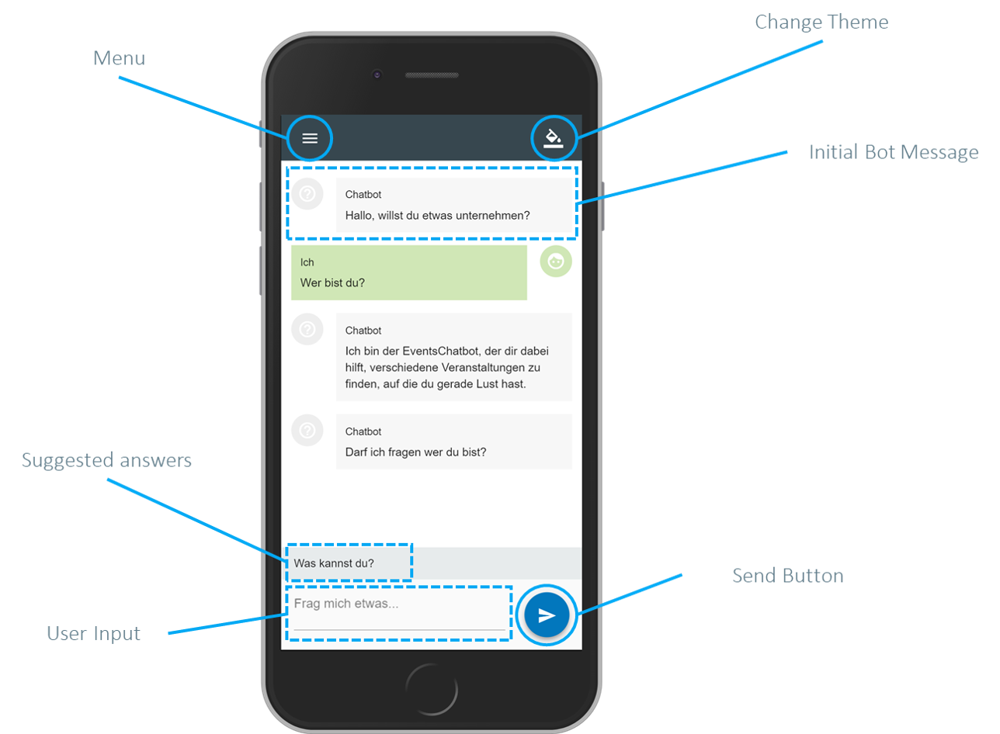
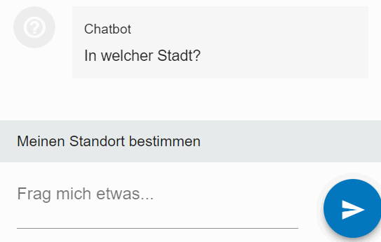
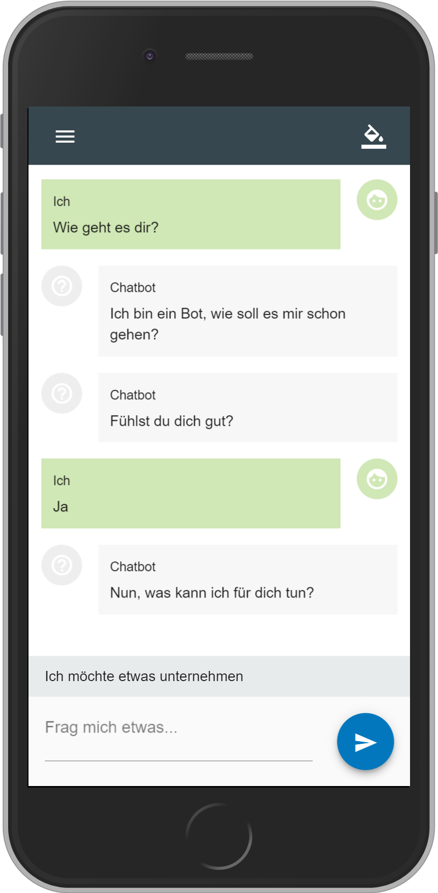
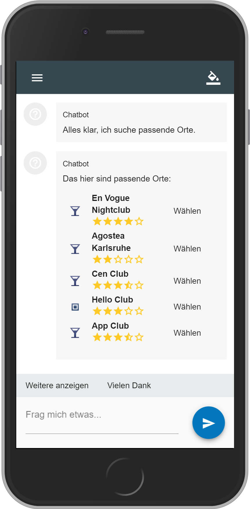
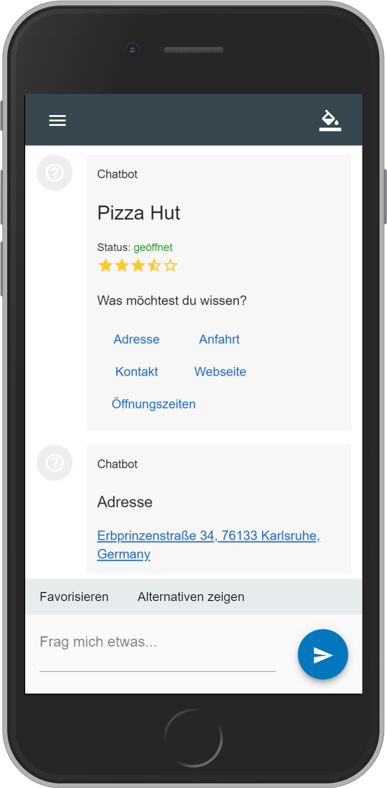
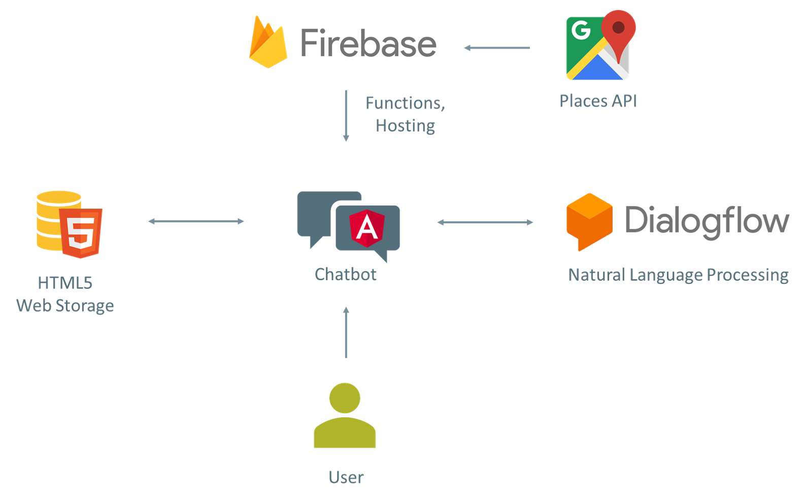

# Angular Events Chatbot

A chatbot that provides you some interesting locations in your neighborhood. You are bored and want to do something?

> Just ask the bot:
<a href="https://events-chatbot.firebaseapp.com/" target="_blank">https://events-chatbot.firebaseapp.com</a>

## Components

<p align="center">
    
</p>

## Use cases
You can ask the bot multiple questions and he will react properly. 

Possible questions you can ask the bot (only German):

- "Wie kannst du mir helfen?"
- "Wer bist du?"
- "Was kann ich heute tun?"
- "Was schlägst du mir vor?"

or more precisely:

- "Ich will Pizza essen gehen"
- "Ich will in Karlsruhe Pizza essen gehen"

be kind:

- "Danke schön"
- "Du bist der beste"

make smalltalk:

- "Wie geht es dir?"
- "Wie heißt du?"

or send smileys:

- ":)"
- "xD"
- "lol"

or where you want to search the locations:

- "Ich wohne in Karlsruhe"
- "Karlsruhe"

and it is even possible to let the bot find out your current position:



## Screenshots

<p align="center">
    
    
    
</p>


## Architecture

### Angular
The chatbot is based on the [Angular Framework](https://angular.io/). It was created and implemented with the help of [Angular CLI](https://cli.angular.io/) and [Angular Material](https://material.angular.io/).

### Dialogflow
To understand what the user is actually saying the bot sends the input message from the user to [Dialogflow](https://dialogflow.com/). Dialogflow helps the bot to create a conversation with the user. Furthermore it enables the bot to behave natural, i.e. answer with different answers and react properly to the user's questions. It also send the user some suggestions how he could answer to questions of the bot.

### Firebase Functions
The chatbot uses the Firebase Functions for the backend functionality. The backend is very small and is only used as a proxy for the Google Places API.

Using the [Express](https://expressjs.com/) node library, the functions provide some APIs to call the Google Places APIs to get the requested information about locations.

### HTML5 Web Storage
With the HTML5 local storage technology the bot caches some user informations. The following two informations are cached there:

- Design Theme
- Locations that are favored by the user

It would be also possible to save this data in a real database in the backend. But I decided to make the bot very lightweighted without lots of serverside stuff like authentication or user sessions. This makes it very easy to try out the bot without big barriers for the user.

### Overview

The following image gives you a short overview about the underlying technologies of the chatbot:

<p align="center">    
    
</p>

## Development

### Node.js
- Install [Node.js](https://nodejs.org/en/) on your computer.

### Angular
The bot is implemented as an Angular web application. To start the application navigate into the `bot-client`-directory and run the following command in your terminal:

```
npm start
```

This command creates a small development server which is running in your browser: [http://localhost:4200/](http://localhost:4200/).

You can also install Angular CLI globally with this command:

```
npm install @angular/cli --global
```

Then you can start the application with `ng serve --open`.

Finally you also want to deploy the application on a production server. Therefore you have to type the following command in your terminal:

```
npm run build
```

This creates a `dist`-folder containing the bundled files that can be uploaded to a web server.

### Dialogflow
This application is so configured that is uses a specific token to get access to the firebase project. The token cannot be used for other purposes. If you want your own firebase project you have to change the access token.

The token can be found in the `/bot-client/src/environments`-directory in the `environment.ts`-file.

### Google API

For the Google Places API is an authentication token required. You have to [create your own access key](https://developers.google.com/maps/documentation/javascript/get-api-key?hl=de). Create a `.env`-file in the `functions`-directory and insert the token like this:

```
GOOGLE_KEY=MY_ACCESS_TOKEN
```